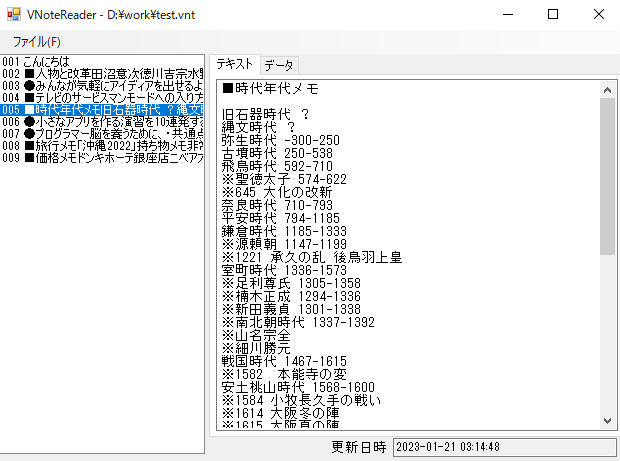
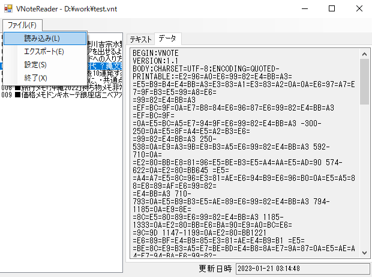

# VNoteReader

- VNote形式(拡張子.vnt)ファイルを読み取るのに適当なWindowsアプリが無かったので作りました。
- これまで SHARPのAQUOS PHONE を使っていて、標準でメモ帳アプリが入っていましたが、最近Google Pixelに乗り換えました。
- 書き溜めたメモが移行できなかったものの、他のメモ帳アプリを使う気がせず、なんとかまとめてテキストファイルにできないものかと思い、これを作りました。
- 今のところ、文字セットはUTF-8のみ対応です。
- また、QUOTED-PRINTABLEな形式のみ対応です。
- 画面キャプチャ画像
  - メイン画面(適当なvntファイルを読み込ませたところ)
    - 
  - 元のデータを表示させたところ
    - 
  - メニューバー「ファイル」を表示させたところ
    - 
- ファイルを読み込ませるにはメニューバー「ファイル」から「読み込み」を選択するとファイル選択ダイアログが表示されるので、読み込ませたいファイルを選択します。
  - または画面左部のメモリストにファイルをドラッグアンドドロップさせます。
- テキストファイルにエクスポートするにはメニューバー「ファイル」から「エクスポート」を選択するとファイル選択ダイアログが表示されるので、出力したいフォルダを選択し、ファイル名を入力します。
  - ファイル名はここで指定したファイル名に連番が付与されたものとなります。
    - \path\to\aaa.txt を指定すると \path\to\aaa_001.txt、\path\to\aaa_002.txt、\path\to\aaa_003.txt、…が出力されます。
      - メモの件数分のファイルが出力されます。
- メニューバー「ファイル」には「設定」もありますが、これで表示させるフォントを変更できます。
- とりあえず私はこれで旧スマホからメモをパソコンに移せたので私的にはよしとします。
  - 気が向いたら改良等するかもしれませんが、優先度は低いかも…
